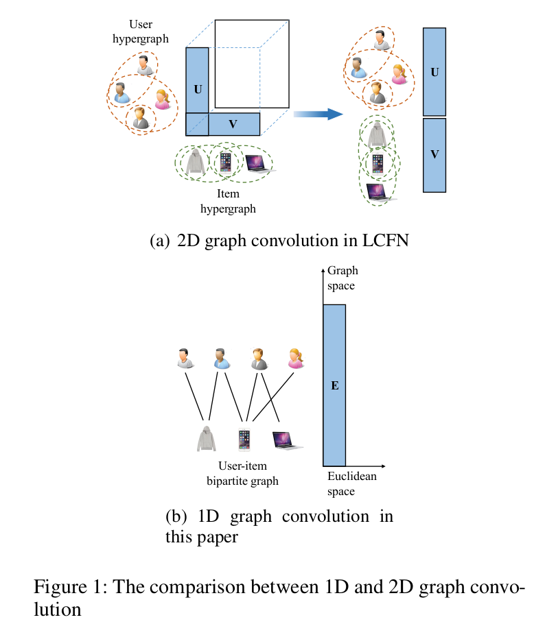
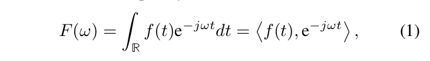
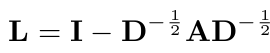

### Abstract

频谱图卷积对于大型图来说非常耗时，因此现有的图卷积网络（GCN）通过多项式重建内核，该多项式（几乎）是固定的。 为了通过学习内核从图形数据中提取特征，提出了低通协同滤波器网络（LCFN）作为具有可训练内核的新范式。 但是，LCFN 有两个缺点：（1）LCFN 中的超图是通过挖掘用户-项目二分图的 2 跳连接构建的，因此没有使用 1 跳连接，导致信息丢失严重。 (2) LCFN 跟随GCNs 的一般网络结构，因此该结构是次优的。 为了解决这些问题，我们利用二分图直接定义图空间，并根据实验探索最佳网络结构。 对两个真实世界数据集的综合实验证明了所提出模型的有效性。

### Introduction

卷积神经网络 (CNN) 通过学习内核获得了强大的特征提取能力（Krizhevsky、Sutskever 和 Hinton 2012）。 为了探索推荐等图学习任务中的卷积，将其从欧几里得域扩展到图域（Shuman et al. 2013），然后注入到深度结构中提出图卷积网络（GCNs）（Kipf and Welling 2017；Defferrard、Bresson 和 Vandergheynst 2016；He 等人 2020；Hamilton、Ying 和 Leskovec 2017）。 然而，由于图卷积对于大型图来说非常耗时，Kipf 和 Welling (2017) 通过将内核固定为一阶多项式来简化它，因此 GCN 失去了提取特征的能力，只能通过图传播嵌入。

为了缩小这一gap，Yu 和 Qin (2020) 提出了一种通过低通协同滤波器 (LCF) 简化（光谱）图卷积的无损方法。 图卷积在频域中定义（Shuman et al. 2013），信号的全频分量参与计算。 经LCF滤波后，只保留极少比例的分量（低频分量）需要计算，效率大大提高。 LCF 和图卷积用于设计端到端 GCN，称为 LCF 网络 (LCFN)，其中内核是可训练的。 LCF 的另一个好处是消除噪声。 由于随机曝光和量化，观察到的交互反映了用户的偏好，但包含噪声。 Yu and Qin (2020) 指出用户偏好是低频，噪声是高频，因此可以通过 LCF 来区分。 正如我们所见，LCF 有助于提高效率和有效性。

但是，仍有很大的改进空间。 首先，LCFN 使用 2D 图卷积，用 user-user 和 item-item 超图定义了二维的图空间。 这些超图是由用户-项目二分图的2跳连接构成的，因此没有1跳连接，导致信息丢失。 更重要的是，由于特征图是大而密集的矩阵，它们在 LCFN 中被分解存储，使得交互矩阵的 2D 卷积退化为嵌入的两次 1D 卷积。 我们可以看到，LCFN 付出了信息丢失的代价，但并没有实现真正的 2D 图卷积。 考虑到这个问题，我们利用观察到的二分图直接定义图空间。 具体而言，我们将二分图视为同构图并设计一维图卷积。 在这种情况下，用户和项目都对某个用户的卷积做出了贡献。

其次，LCFN 将注意力集中在引入新的图卷积上，同时简单地遵循 GCN 的一般网络结构和模型设置。 使用了许多不必要的结构和次优的模型设置，增加了模型训练的难度，降低了模型的性能。 为了解决这些问题，我们设计了实验来探索所提出模型的最佳结构和设置。

最后，我们将一维谱图卷积注入调谐网络，并提出我们的低通图卷积网络（LGCN）。 总结起来，贡献如下：

- 我们提出一维图卷积来利用观察图的直接连接。 然后，我们设计了一个 1D LCF，并将其与 1D 图卷积集成为低通图卷积。
- 我们将一维低通图卷积注入到深层结构中。 我们设计了综合实验来探索最佳模型结构和设置。
- 我们对两个真实世界的数据集进行了实验，以验证我们提出的模型的有效性。 实验表明，该模型的性能明显优于最先进的模型。

### Related Work

最广泛使用的推荐模型是潜在变量模型 (Koren 2009; He et al. 2017; He and Chua 2017)，它通过嵌入对用户偏好和项目属性进行编码，并根据嵌入之间的距离来衡量用户对项目的偏好。 在潜变量模型中，嵌入是最重要的参数。 为了学习更好的嵌入，已经提出了许多变体（Ying 等人 2018；Berg、Kipf 和超图 Welling 2018；Wu 等人 2019b；He 等人 2020；Yu 和 Qin 2020）。

图神经网络 (GNN)（Wang 等人 2019；Wu 等人 2019b；Ying 等人 2018；Berg、Kipf 和 Welling 2018）是表示学习最有效的范式之一。 GNN 使用邻居的嵌入来细化每个节点的嵌入。 具体来说，GNN 通过二分图传播项目超图嵌入。 嵌入通过一个传播层传播到 1 跳邻居，通过堆叠几层，GNN 实现长距离传播。 对于每个节点，嵌入由 L 跳内的邻居细化，其中 L 是深度。 GNN 确保连接的节点具有相似的嵌入，因此提供了一种利用协作信息的明确方式。 然而，GNN 仅利用图来平滑嵌入。 需要可以利用图来提取高级特征的深度模型。

受 CNN 的启发，提出了图卷积来提取图数据的特征。舒曼等人。 (2013) 将卷积从欧几里得域扩展到图域，Defferrard、Bresson 和 Vandergheynst (2016) 提出了利用图卷积提取高级特征的 GCN。为了将图卷积用于推荐任务，Kipf 和 Welling (2017) 通过修复内核提高了效率，同时让 GCN 退化为 GNN。继 Kipf 和 Welling（2017）之后，大多数现有的 GCN（Wang 等人 2019；Ying 等人 2018；Berg、Kipf 和 Welling 2018；He 等人 2020）成为 GNN 或变体。为了解决这个问题，Yu 和 Qin (2020) 提出了一种具有可学习内核的低通图卷积网络，称为 LCFN。然而，LCFN 的 2D 图卷积会导致信息丢失。此外，网络结构和模型设置也相当欠佳。吴等人。 （2019a）；他等人。 (2020) 指出，不必要的组件会对模型性能产生负面影响。在本文中，我们探索了更好的低通图卷积和更好的模型结构。

受 CNN 的启发，提出了图卷积来提取图数据的特征。舒曼等人。 (2013) 将卷积从欧几里得域扩展到图域，Defferrard、Bresson 和 Vandergheynst (2016) 提出了利用图卷积提取高级特征的 GCN。为了将图卷积用于推荐任务，Kipf 和 Welling (2017) 通过修复内核提高了效率，同时让 GCN 退化为 GNN。继 Kipf 和 Welling（2017）之后，大多数现有的 GCN（Wang 等人 2019；Ying 等人 2018；Berg、Kipf 和 Welling 2018；He 等人 2020）成为 GNN 或变体。为了解决这个问题，Yu 和 Qin (2020) 提出了一种具有可学习内核的低通图卷积网络，称为 LCFN。然而，LCFN 的 2D 图卷积会导致信息丢失。此外，网络结构和模型设置也相当欠佳。吴等人（2019a）和何等人(2020) 指出，不必要的组件会对模型性能产生负面影响。在本文中，我们探索了更好的低通图卷积和更好的模型结构。

### 1D Low-pass Graph Convolution

图 1 显示了 2D 和 1D 低通图卷积的比较。我们用虚线表示超图的超边，用实线表示图的边。蓝色矩形表示嵌入，白色矩形表示特征图。如图 1(a) 所示，特征图上的 2D 图卷积成为 LCFN 中嵌入的 1D 图卷积的两倍。图 1(b) 显示了本文提出的 E 上的一维图卷积。虽然 E 是一个二维矩阵，但它确实是一维图数据，因为 E 只有一个维度在图空间中，而另一个维度在欧几里得空间中。结果，只需要一维图卷积。
由于该图卷积是在频域定义的，我们首先引入图傅里叶变换，然后设计低通图滤波器LCF和图卷积。最后我们将它们整合以获得低通图卷积。为了简洁地表述每个部分，我们使用嵌入 e = E∗k 的某一列作为图数据，并且对于所有列，我们做同样的事情。

#### 图的傅里叶变换

一维傅里叶变换是频域上信号和基底的内积

将该定义推广到图数据，需要

- 引入空间内的差分算子

  

- 

