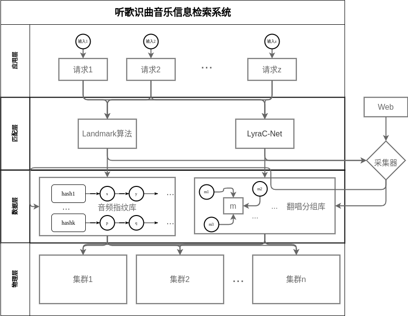

# 听歌识曲系统设计文档

2012522 郭坤昌 计算机科学与技术

## 摘要

艺术与技术的结合是大势所趋，价值不可估量。本文受李伟等人对基于内容的音乐信息检索的综述[^1]启发，针对音乐信息检索子领域的关键问题——音频匹配问题，结合实际运用中的“听歌识曲”功能，提出具体实现的技术路线和实现方案，即结合音频指纹技术识别原曲的优点与深度学习网络识别翻唱歌曲的优点，构建准确高效的听歌识曲系统。

## 关键词

基于内容的音乐信息检索，音频指纹，Landmark算法，LyraC-Net，听歌识曲

## 背景与意义

### 音乐信息检索的定义与发展

音乐信息检索是使用数字技术对音乐数据进行分析、理解和创作的交叉学科[^2]，融合了数字技术与音乐艺术。在十九世纪五十年代，出现了使用数字技术分析音乐的探索；七十年代后，欧美亚陆续建立计算机音乐研究机构；从二十世纪九十年代开始，随着互联网技术、以MP3为代表的音频压缩技术、传统音乐介质被硬盘取代，数字音乐的海量数据促进了音乐信息检索的发展；2000年国际音乐信息检索学术会议ISMIR（International Society for Music Information Retrieval Conference）的建立可以视为这一领域的正式创建。

### 研究领域与现实意义

音乐信息检索领域可以分为核心领域与应用领域[^1]，核心层主要包括音乐乐理知识与歌声处理领域，应用层关注基于核心层的应用。下图摘自参考文献[^1]，展示了音乐信息检索的研究领域及核心层与应用层的关系。除此之外，应当还包括基于数字技术的音乐创作等。

当下时代是一个充斥海量音乐数据的时代，音乐信息检索不仅与人民的物质、文化生活息息相关，相关技术更可运用于安全领域（音频指纹等）。借助人工智能等现代技术，结合传统声学知识，有助于激发人类新的创造活力，也提供了对艺术的崭新诠释。

## 现状分析

### 音频指纹——音乐信息检索的关键问题

每段音乐都各不相同，如何分析和理解音乐在各个“维度”上的“特征”就是关键问题，有了这些关键特征，就能将其在各个领域进行运用。本文从实际运用中的“听歌识曲”出发设计检索系统，重点关注“音频指纹”技术。

音频指纹是指可以代表一段音频重要声学特征的数字签名。提取特征的算法是获取音频中各种时域和频域的特征信息，建模得到指纹。实际特征有很多，通常结合起来使用。

### 听歌识曲技术发展

以全球最大的听歌识曲软件Shazam为例，其曾经使用的基于Landmark的音频指纹技术[^3]建立在假设“识别的音频是原音频在某一时间开始的一部分”，因此对输入失真、翻唱、混声等情况不具有很好的泛用性。该技术目前大量落地，对原曲的识别具有较好效果。

2017年前的识别技术选用不同特征解决变调问题，而之后的处理技术逐渐向深度学习方向发展。目前腾讯音乐天琴实验室的LyraC-Net[^4]在翻唱识别上做到了业界最优。然而，该技术在低信噪比的情况下，识别效果不佳。

在接下来的系统设计中，考虑结合传统音频指纹技术与目前的深度学习技术，以发挥各自优势。

## 方案设计

### 目的功能与特点

针对主要业务“听歌识曲”，提出如下要求：

- 完整性。音乐数据库的构建应当针对某个特定的分类领域或全领域，有较为完整的收录；完整性是准确性的前提之一。

- 准确性。输入的音频是片段，而非整首歌曲，首要保证的是返回的唯一一个相似度最高的结果是准确的。
- 高效性。对于在线查询，需要在海量的音频数据中实时返回查询结果，应当能够快速查询到结果；但由于用户一般不进行短时大量的查询，因此结果返回不至于太慢即可。
- 高并发。能够同时处理大量用户的识别请求。
- 泛用性。识别过程不受音频本身的储存格式，编码方式，码率和压缩技术影响；能够处理存在噪声与失真的情况，以及对原曲进行了较大改编的情况。
- 扩展性。引入歌词识别，实时匹配出片段对应的歌词，提升用户体验。

### 系统架构设计

结合音频指纹技术与深度学习技术，将各自对原曲识别与翻唱识别的优势综合，作为核心的音频特征提取技术。类比Web搜索引擎架构，设计听歌识曲检索系统主要架构如下：

- 物理层：（分布式）服务器（集群）

- 数据层：以倒排索引模式存储的音频指纹索引、歌曲翻唱分组信息

- 匹配层：计算音频指纹，匹配指纹库；使用DNN计算翻唱歌曲分组

- 应用层：高并发的音乐采集与检索接口

下图是听歌识曲音乐检索系统的架构示意图。采集器跨多个层次，从Web中获取音乐数据，并调用下层接口，进行入库和索引建立，因此可以划分在应用层中。（图中匹配层的技术在技术路线部分进行详细介绍）

### 请求处理流程

用户请求处理按如下方式进行。首先输入音频，进行预处理，再分别通过Landmark算法和LyraC-Net进行指纹提取和分类，根据返回结果的个数，选择最匹配的一个结果，或选择让用户重新输入音频。

### 需要解决的问题

- 音频文件的存储问题。歌曲信息浩如烟海，需要判断采集的歌曲，是另一首已入库歌曲的原版，还是另一位歌手的翻唱。一般思路是通过采集的歌曲名、歌手进行初步筛选；若没有记录，则可以入库，否则需要根据音频内容进行进一步判断。
- 检索结果的评价问题。该架构使用基于音频特征和深度学习网络的检索匹配技术，两种技术的评价指标各不相同，若同时都有结果返回，则可以考虑，预先进行机器学习，得到正确率高的决策模式，应用到实际中。

## 技术路线

听歌识曲系统采取的关键技术种类繁多，这里针对音乐信息检索部分的关键内容，即音频检索技术和深度学习算法，进行详细介绍。

### 音频指纹提取

使用Shazam公司提出的Landmark算法构建音频指纹，主要流程如下图：

首先使用快速傅里叶变换将原曲由时序变换到频域。再从得到的频谱图中提取Landmark。频谱图的z轴表示能量，从频谱图中提取Landmark（能量峰值），它们作为能量极大值点具有很强的抗噪能力，如下图中黑点所示即为Landmark：

接下来构造指纹。对于每个Landmark（anchor point）都有一个人为指定的Target Zone（如下图1C矩形部分），将anchor point与Target Zone中每一个Landmark构造指纹。该指纹具有三个属性，如下图1D横坐标为时间，纵坐标为频率，则该指纹的属性包含了时间差和频率差，最后，该指纹有唯一的指纹时间。

若为建立数据库过程，则最终将计算得到的指纹入库，可以使用hash表的形式存储；若为检索过程，则使用计算得到的指纹进行hash计算，最后检索指纹库，获得可能的匹配结果。

### LyraC-Net

对于输入的一般音频，需要使用恒Q变换[^6]，获取CQT频谱作为LyraC-Net的输入。CQT变换与傅里叶变换不同点在于，傅里叶变换得到的音频谱是线性分布的，频率点不能一一对应；而CQT分布与音阶频率分布相同，因此计算CQT谱能直接得到音乐信号在各个音符处的振幅值。

主要技术路线基于LyraC-Net[^4]提出的的结合分类与度量学习的方法。首先对输入的CQT特征频谱进行数据增强，之后通过宽度神经网络结合联合损失函数进行训练。整体结构如下：

使用的主要技术包括：

- 数据增强：随机裁剪输入特征获得随机样本，这样可以提取到随机的特征；在频域和时域上随机使用bin（直方图中的子空间，即纵向条带[^5]）来屏蔽CQT特征。
- 模型结构：使用宽度残差网络（增加了残差网络的宽度，减少了深度）作为主干架构。
- 联合表示：使用三元组损失函数（triplet loss，基于三元组网络，解决多分类问题）和原型损失函数（prototypical loss，基于原型网络，解决小样本学习问题），再引入分类损失函数（softmax loss）和度量学习损失函数（metric learning loss），将它们进行线性加权，获得稳定的联合损失。

模型结构与联合表示的关系如下图所示：

最终判定翻唱分组的方式采用Softmax分类得到。

## 总结

本次作业既关注信息检索领域的关键问题，又强调应用系统的具体构建，需要结合实际调查与具体需求。在查找音乐信息检索领域问题的过程中，从综述文献中对该领域有了大致的了解，包括划分、关键问题、存在的挑战以及目前的解决思路等，拓宽了视野。本次设计整体上的构建思路还是沿用了前人的观点，思路是使用现成的工具，结合它们各自的优势解决听歌识曲存在的问题。可以相信的是，最终可以有统一的思路和方法应对原曲或者翻唱在识别过程中的问题。

## 参考文献

[^1]:李伟,李子晋,高永伟.理解数字音乐——音乐信息检索技术综述[J].复旦学报(自然科学版),2018,57(03):271-313.DOI:10.15943/j.cnki.fdxb-jns.2018.03.001.
[^2]: [音乐信息检索MIR 百度百科](https://baike.baidu.com/item/%E9%9F%B3%E4%B9%90%E4%BF%A1%E6%81%AF%E6%A3%80%E7%B4%A2MIR/23473330)
[^3]: Wang, Avery. "An industrial strength audio search algorithm." *Ismir*. Vol. 2003. 2003.
[^4]: Hu, S., Zhang, B., Lu, J., Jiang, Y., Wang, W., Kong, L., Zhao, W., Jiang, T. (2022) WideResNet with Joint Representation Learning and Data Augmentation for Cover Song Identification. Proc. Interspeech 2022, 4187-4191, doi: 10.21437/Interspeech.2022-10600
[^5]: [《数字图像分析》提纲第九章](https://ustc-dia.github.io/slides_2022_spring/%E7%AC%AC9%E7%AB%A0-9.1%20%E5%9B%BE%E5%83%8F%E8%A1%A8%E8%BE%BE%E4%B8%8E%E6%8F%8F%E8%BF%B0-new(1).pdf)
[^6]: [基于音乐识别的频谱转换算法——CQT 简书](https://www.jianshu.com/p/53c93947c417)
