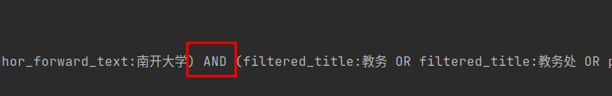
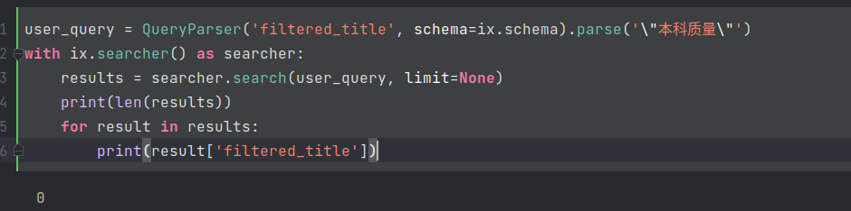

# 信息检索系统原理大作业——基于南开大学校内网页的web搜索引擎
2012522 郭坤昌 计算机科学与技术

## 序言

该搜索引擎基于南开大学校内网站，借助全文搜索引擎Whoosh构建索引并提供部分基本查询功能，使用PageRank算法、按时间排序与站点过滤提供高级查询功能，并使用文本聚类与偏好分析结合的方法提供个性化查询功能。在个性化推荐方面，使用基于物品的协同过滤算法进行网页推荐。

## 关键词

链接分析，基于物品的协同过滤算法，K-Means聚类，个性化

## 项目结构


## 网页抓取

在本搜索引擎构建过程中，需要爬取网页的url,标题、纯文本、锚文本、超链接等。其中url是访问网页的地址，标题、纯文本、锚文本用以构建不同域上的索引，超链接用以爬取链接网页并参与PageRank计算。

由于scrapy框架有分布式、高并发、自动过滤重复请求、自动断点续爬等优点，因此使用该框架进行网页爬取。由于数据使用JSON格式存储较为方便，因此选用MongoDB作为数据库存储网页文档信息。为了减少存储空间及方便表示，建立自增id与网页url的唯一对应表，并在后续记录前向链接关系时，使用网页id作为网页唯一标识。

爬取过程以[南开大学首页](htttps://www.nankai.edu.cn/)为起始站点。获取爬取网站所有锚的超链接，添加到下一步爬取的列表中。记录下当前网页的所有信息（url、标题、纯文本、锚文本、爬取时间），生成的item对象由pipeline存储到MongoDB数据库中；对于爬取列表中的超链接，则生成request对象，爬取该网页。该过程递归执行，直到爬取完毕。本次实验中，共爬取了约六千个网页，最后无法继续爬取是因为请求超时（可能为没有在校内连接导致）。

最终爬取网页结果如下：


## 索引构建
分别在url、标题、网页纯文本、锚文本域上建立索引，其中url、标题、网页纯文本域上的词项索引到该网页的id，锚文本域上的词项索引到跳转的网页的id。

借助开源工具Whoosh（Whoosh是基于Python的全文搜索引擎，相较于ElasticSearch更轻量级且容易使用）构建索引，并使用jieba中文分词。

### 数据修正

在构建索引之前，首先对索引域的数据进行修正，主要包括以下三个部分：

1. 修正前向链接。网页在实际爬取时，往往出现重定向问题（详见其他问题部分），因此需要将被重定向的网页编号替换为重定向后的网页编号（解决过程也请查看其他问题的这一部分）。
2. 补充后向链接文本。指向该网页的锚包含的文本也包含了该网页的相关信息，因此需要将锚文本添加到锚的超链接对应的网页文档中，作为索引域。

```python
def implement_backward_anchor_text(self):  # backward anchor text helps with searching anchor href
    def filter_str(str):  # remove all whitespace. although filtered in spider, there are still some whitespace
        return re.sub(r'\s+', '', str)
    def get_type(url):
        return re.sub(r'/', '', url.split('.')[-1])
    web_page_ids = [web_page_id['url_id'] for web_page_id in self.web_page_collection.aggregate([{'$project': {'url_id': 1}}])]
    for web_page_id in web_page_ids:
        web_page = self.web_page_collection.find_one({'url_id': web_page_id})
        anchor = web_page['anchor']
        for href in anchor:
            text = filter_str(anchor[href])
            href_id = self.url_collection.find_one({'url': href})['url_id']
            redirect = self.redirect_collection.find_one({'from_url_id': href_id})
            redirect_from = 0
            if redirect is not None:
                redirect_from = href_id
                href_id = redirect['to_url_id']
            if href_id in web_page_ids:
                if text == '':
                    continue
                anchor_backward_text = self.web_page_collection.find_one({'url_id': href_id})['anchor_backward_text']
                if anchor_backward_text == '':
                    new_anchor_backward_text = text
                else:
                    anchor_backward_text_list = anchor_backward_text.split(',')
                    if text in anchor_backward_text_list:
                        continue
                    new_anchor_backward_text = anchor_backward_text + ',' + text
                self.web_page_collection.update_one({'url_id': href_id}, {'$set': {'anchor_backward_text': new_anchor_backward_text}})
```

3. 合并重复网页。一些网页除了url不同，其实是同一个网页，一个简单示例如下：

显然，重复网页相关性得分相同，将影响整个计算结果。


使用文档的文本计算md5作为文档的唯一标识。首先选出具有相同内容的文档，决定保留第一个爬取的文档，在锚的超链接列表中，将其他相同文档替换为保留文档，最终在表中删除被替换的文档。

```python
def collapse_the_same(self):  # eliminate same page. md5 should be calculated in spider, but I found it too late
    def get_md5(str):
        return md5(str.encode('utf-8')).hexdigest()
    web_page_ids = [web_page_id['url_id'] for web_page_id in self.web_page_collection.aggregate([{'$project': {'url_id': 1}}])]
    
    for web_page_id in web_page_ids:
        web_page = self.web_page_collection.find_one({'url_id': web_page_id})
        page_md5 = get_md5(web_page['title'] + web_page['pure_text'] + web_page['anchor_backward_text'] + web_page['anchor_forward_text'])
        self.web_page_collection.update_one({'url_id': web_page_id}, {'$set': {'md5': page_md5}})
    url_id_lists = [url_id['url_id'] for url_id in self.web_page_collection.aggregate([{'$group': {'_id': '$md5', 'url_id': {'$push': '$url_id'}, 'count': {'$sum': 1}}}, {'$match': {'count': {'$gt': 1}}}, {'$project': {'url_id': 1}}])]
    for url_id_list in url_id_lists:
        url_id_to_keep = url_id_list[0]
        url_id_to_delete = url_id_list[1:]
        for url_id in url_id_to_delete:
            forward_links_list = self.web_page_collection.find({'forward_links': {'$in': [url_id]}})
            for forward_links in forward_links_list:
                new_forward_links = (set(forward_links['forward_links']) - {url_id}) | {url_id_to_keep}
                self.web_page_collection.update_one({'url_id': forward_links['url_id']}, {'$set': {'forward_links': list(new_forward_links)}})
```

以如下例子为例，最终运算结果中，表示首页的`index.htm`实际上与原网站相同，因此被替换。消除了重复网页。


具体替换结果如下，经验证如下替换结果其实不完全正确，仍有部分网站不重复但被替换。原因是爬取过程采集网页纯文本时，为了简便，没有采集所有文本标签，即只采集了`<p><li><h1><h2>`，因此若网页除了上述部分，仍存在不同的话，会被替换。当然，考虑全部文本标签，则该问题迎刃而解。


### 使用Whoosh建立索引

建立索引过程需要指定建立索引的模式，在类初始化时完成，需要在url，标题，网页纯文本（`<p>`标签文本等），后向链接文本（指向该网页的锚文本），前向链接文本（一定程度上也与该网页有关）上建立索引。之后在计算完PageRank得分后，使用Whoosh建立索引。

```python
#...
from whoosh.index import create_in
from whoosh.fields import Schema, TEXT, ID, DATETIME, NUMERIC
from jieba.analyse import ChineseAnalyzer
import datetime

class Indexer():
    def __init__(self):
        #...
        self.analyzer = ChineseAnalyzer()
        self.schema = Schema(
            url_id=ID(unique=True, stored=True),
            url=ID(unique=True, stored=True),
            filtered_title=TEXT(stored=True, analyzer=self.analyzer),
            pure_text=TEXT(stored=True, analyzer=self.analyzer),
            anchor_backward_text=TEXT(stored=True, analyzer=self.analyzer),
            anchor_forward_text=TEXT(stored=True, analyzer=self.analyzer),
            page_rank=NUMERIC(stored=True),
            crawl_time=DATETIME(stored=True),
        )
        if not os.path.exists('index/indexdir'):
            os.mkdir('index/indexdir')
        self.ix = create_in('index/indexdir', self.schema)
        self.writer = self.ix.writer()
        self.page_rank_calculator = PageRankCalculator()
        
    #...
    def build_index(self):
        web_page_ids = [web_page_id['url_id'] for web_page_id in self.web_page_collection.aggregate([{'$project': {'url_id': 1}}])]
        doc_counter = 0
        for web_page_id in web_page_ids:
            web_page = self.web_page_collection.find_one({'url_id': web_page_id})
            # write data to whoosh
            self.writer.add_document(
                url_id=str(web_page['url_id']),
                url=web_page['url'],
                filtered_title=web_page['filtered_title'],
                pure_text=web_page['pure_text'],
                anchor_backward_text=web_page['anchor_backward_text'],
                anchor_forward_text=web_page['anchor_forward_text'],
                page_rank=web_page['page_rank'],
                crawl_time=datetime.datetime.strptime(web_page['crawl_time'], '%Y-%m-%d %H:%M:%S'),
            )
            doc_counter += 1
            if doc_counter % 1000 == 0:
                self.writer.commit()
                self.writer = self.ix.writer()
        if doc_counter % 1000 != 0:
            self.writer.commit()
            self.writer = self.ix.writer()
```

## PageRank

结果排序依照概率检索模型BM25F得分和PageRank得分的加权评分得到。为了优化查询体验，考虑到数据大多数时候是过剩的，因此查询结果应当尽量准确，因此选择给前k个结果赋予较高的相关度得分权重，降低PageRank得分的权重，以提高前面查询结果的准确率。同时按照最高得分进行归一化，这样当相关度得分相近时，可以根据权威值差异进行排序。BM25F得分主要由Whoosh后端计算得到，这里主要介绍PageRank的计算过程。

爬取过程记录了当前网页的前向连接网页，这样就可以使用PageRank算法衡量url的权威性。PageRank的计算方法有很多，这里不使用构造转移矩阵的方法，而是根据定义直接迭代计算。一个网页的PageRank值，由指向该网页的后向网页将自身权重按出度均分，传递给该网页；考虑到随机跳转，设阻尼系数为$\alpha$，总网页数量为$N$，则随机跳转到其他网页的概率为$(1-\alpha)/N$。每次迭代时，网页$A$的PageRank值由以下公式计算得到：
$$
PageRank(A) = \alpha \sum_{in}^{} PageRank(in) / OutDegree(in) + (1-\alpha )/N
$$
### 使用有向图按定义实现

实现过程使用Python库networkx中的Digraph（有向图）类。首先从爬取结果中建立有向图，接着将所有没有出度的节点建立与向其他所有节点的边，即为了模拟随机跳转；接着在每轮迭代过程中，统计所有网页PageRank值变化之和，若变化小于一定限度，则认为继续迭代对网页权重影响不大，结束计算，否则达到最大迭代次数，结束计算；最后将PageRank值保存下来。主要PageRank计算代码如下：

```python
import networkx as nx
import pymongo
class PageRankCalculator:
    #...
    def calculate_page_rank(self):  # add nodes and edges to graph. page rank init with -1. calculate page rank by iteration
        web_page_and_forward_links = self.web_page_collection.aggregate([{'$project': {'url_id': 1, 'forward_links': 1}}])
        for web_page in web_page_and_forward_links:
            home_page_id = web_page['url_id']
            forward_link_ids = web_page['forward_links']
            if home_page_id not in self.graph.nodes():
                self.graph.add_node(home_page_id, page_rank=0)
            for forward_link_id in forward_link_ids:
                if forward_link_id not in self.graph.nodes():
                    self.graph.add_node(forward_link_id, page_rank=0)
                self.graph.add_edge(home_page_id, forward_link_id)
        graph_size = len(self.graph.nodes())
        if not graph_size:
            print('graph size is 0. exit.')
            return
        self.damping_value = (1 - self.damping_factor) / graph_size
        for node in self.graph.nodes():
            self.graph.nodes[node]['page_rank'] = 1 / graph_size
            if self.graph.out_degree(node) == 0:   # if node has no out degree, add edges to all nodes.
                for another_node in self.graph.nodes():
                    self.graph.add_edge(node, another_node)
        for i in range(self.max_iterations):
            delta = self.iterate()
            self.iteration_counter += 1
            if delta < self.min_delta:
                break
        for node in self.graph.nodes():
            self.web_page_collection.update_one({'url_id': node}, {'$set': {'page_rank': self.graph.nodes[node]['page_rank']}})
        print('page rank calculation finished. iteration: {}, delta: {}'.format(self.iteration_counter, delta))

    def iterate(self):
        delta = 0
        for node in self.graph.nodes():
            rank = 0
            for in_node in list(self.graph.in_edges(node)):  # translate to list. ref: https://stackoverflow.com/questions/47325667/object-is-not-subscripable-networkx
                in_node = in_node[0]
                rank += self.graph.nodes[in_node]['page_rank'] / self.graph.out_degree(in_node)
            rank = self.damping_value + self.damping_factor * rank
            delta = abs(self.graph.nodes[node]['page_rank'] - rank)
            self.graph.nodes[node]['page_rank'] = rank
        return delta
```

计算结果如下图所示，在第39轮时满足精度。


### 参与结果排序

观察PageRank计算结果，`www.nankai.edu.cn`有着最高的PageRank得分，这个结果十分显然。但其指向的网页，也具有较高的得分，且与其他得分较低的网页，差距在几个数量级。


在结果排序中，想要做到当相关度得分差距不大时，PageRank影响排序结果。考虑将BM25F得分与PageRank进行归一化后线性加权，PageRank权重为30%

```python
def basic_search(self, query_str):
    results = []
    with self.ix.searcher(weighting=scoring.BM25F) as searcher:
        query = self.parser.parse_query(query_str)
        for result in searcher.search(query, limit=100):
            results.append(self.WebPageItem(result['url'], result['title'], result['pure_text'], result['anchor_backward_text'], result['anchor_forward_text'], result['page_rank'], result['crawl_time'], result.score))
        max_bm25f_score = max([result.score for result in results])
        max_page_rank_score = max([result.page_rank for result in results])
        for result in results:
            result.score = result.score / max_bm25f_score * 0.7 + result.page_rank / max_page_rank_score * 0.3
        results.sort(key=lambda x: x.score, reverse=True)
    return results
```

如下为查询“Nankai”时，相似度得分差距不大，PageRank改变排序结果的例子。英文首页与材料学院首页相似度得分接近，而英文首页PageRank远高于材料学院，因此总得分较高


## 查询功能

查询功能设计包括普通查询和高级查询。

普通查询默认在已经索引的标题、纯文本、后向链接文本、前向链接文本上进行检索，并可以使用`AND`，`OR`，`NOT`，`()`（英文小括号），`*`和`~`指定布尔查询、分组查询、通配查询和模糊查询，通过对查询字符串进行解析得到。

高级查询功能设计参考了百度的高级查询。对于包含全部关键词、任意关键词、完整关键词和过滤关键词的查询可以由普通查询的布尔查询进行得到，这里主要在普通查询的基础上增加了爬取时间过滤和网站地址过滤（即站内查询）。

### 布尔查询

布尔查询主要通过操作符`AND`，`OR`，`NOT`，`()`实现功能。

对于按照空格分隔的词项，如“南开大学 教务处”，将被解析为“南开大学 AND 教务处”（这里为了表达简便省略了对其中的词项进行进一步分词的步骤，分词间的关系为或），实际上我们可能希望查找“南开大学 OR 教务处”，同时包含更多关键词的结果应当具有更高的分数。

```python
class MyQueryParser:
    def __init__(self):
        self.ix = open_dir('index/whoosh_index')
        self.parser = MultifieldParser(['filtered_title', 'pure_text', 'anchor_backward_text', 'anchor_forward_text'], schema=self.ix.schema, group=OrGroup.factory(0.9))

    def parse_query(self, query_str):
        return self.parser.parse(query_str)
```

完整的查询的解析示例结果如下：（由于返回结果长且繁杂，因此只截取关键部分进行说明）

- "南开大学 教务处" 两个主要词项以OR连接，与"南开大学 OR 教务处"分词相同


- "南开大学 AND 教务处"



- "南开大学 AND NOT (教务处 AND 通知)"


### 通配查询

通配查询通过指定`*`运算符得到。需要注意的是，若`*`将一个完整词项“打断”，如“南\*开”，则会认为“南”和“开”是两个词项，这不与词项“南开”匹配；同理，“本科\*质量”可以与“本科教学质量匹配”。




对于中文分词，通配查询的作用其实收效甚微。对于站内查询过程，由于url或者英文以不可分、不可索引的结构存储，通配查询便发挥用处，示例如下：


### 模糊查询

模糊查询通过操作符`~ {number}`来指定，其中number表示模糊的字数。示例如下：


当查询为`信心~2`时，几乎会返回所有文档（即所有文档的分词都是匹配的）。模糊查询严重影响性能，因此默认并不开启。

### 高级查询解析

对于包含全部关键词、任意关键词、完整关键词和过滤关键词的查询可以由普通查询的布尔查询进行得到，这里主要在普通查询的基础上增加了爬取时间过滤和网站地址过滤（即站内查询）

```python
def search(self, any_keywords, all_keywords='', complete_keywords='', mask_keywords='', sort_by_time=False, filter_site=''):
    query_str = '(' + any_keywords + ')'
    if all_keywords != '':
        temp_str = ' AND '.join([keyword for keyword in all_keywords.split(' ')])
        query_str += ' AND (' + temp_str + ')'
    if complete_keywords != '':
        temp_str = ''
        keywords = complete_keywords.split(' ')
        for keyword in keywords:
            temp_str += '"' + keyword + '" '
        query_str += ' AND (' + temp_str + ')'
    if mask_keywords != '':
        temp_str = ' AND '.join([keyword for keyword in mask_keywords.split(' ')])
        query_str += ' AND NOT (' + temp_str + ')'
    if filter_site == '':
        limit = self.limit
    else:
        limit = None
    results = self.basic_search(query_str, limit=limit)
    if filter_site != '':
        for result in results:
            if filter_site not in result.url:
                results.remove(result)
    if sort_by_time:
        results.sort(key=lambda x: x.crawl_time, reverse=True)
    if len(results) > self.limit:
        results = results[:self.limit]
    return results
```

一个高级查询的例子如下：


### 站内查询

站内查询功能已在高级查询功能部分介绍，对查询结果的url进行过滤即可。

对教务处网站的站内查询，返回结果只有两个，且符号查询要求：


### 查询日志

简单记录用户id与高级查询相关参数即可，以备后续再次查询。为了支持个性化推荐，这里记录了用户最近点击的20个网站id

```python
class Recorder:
    def __init__(self, user_id):
        self.mongo_client = pymongo.MongoClient('localhost', 27017)
        self.db = self.mongo_client['mysearchengine']
        collection_names = self.db.list_collection_names()
        if 'history' not in collection_names:
            self.db.create_collection('history')
        self.history_collection = self.db['history']
        if 'user_id_1' not in self.history_collection.index_information():
            self.history_collection.create_index([('user_id', pymongo.ASCENDING)])
        self.user_id = user_id
        if self.history_collection.find_one({'user_id': self.user_id}) is None:
            self.history_collection.insert_one({'user_id': self.user_id, 'search': [], 'recent_click': []})

    def record_search(self, query_str, sort_by_time, filter_site):
        search_history = self.history_collection.find_one({'user_id': self.user_id})['search']
        search_history.append({'query_str': query_str, 'sort_by_time': sort_by_time, 'filter_site': filter_site, 'time': datetime.now()})
        if len(search_history) > 20:
            search_history = search_history[-20:]
        self.history_collection.update_one({'user_id': self.user_id}, {'$set': {'search': search_history}})
        
    def record_click(self, url):
        recent_click = self.history_collection.find_one({'user_id': self.user_id})['recent_click']
        recent_click_urls = [list(item.keys())[0] for item in recent_click]
        if url in recent_click_urls:
            click_times = recent_click[recent_click_urls.index(url)][url]['click_times'] + 1
            recent_click.remove(recent_click[recent_click_urls.index(url)])
            recent_click.insert(0, {url: {'click_times': click_times, 'time': datetime.now()}})
        else:
            recent_click.insert(0, {url: {'click_times': 1, 'time': datetime.now()}})
        if len(recent_click) > 20:
            recent_click = recent_click[:20]
        self.history_collection.update_one({'user_id': self.user_id}, {'$set': {'recent_click': recent_click}})
```

查询日志的记录，以查询“计算机”为例子


测试连续三次访问南开首页，再访问教务处官网，访问记录次数和次序正确


## 个性化查询

查询扩展技术主要基于对数据集本身的分析和对用户查询日志的分析[^1]，旨在提高召回率。一个基本思路是将网页进行聚类，得到不同主题，再根据用户查询的历史，推断近期偏好，从而提高对应主题文本在搜索结果中的排序。与个性化推荐有相似性，但不同在于该过程对查询结果进行进一步排序而非补充新的结果。

由于网页数量众多，实验的思路为：提取文本特征，进行文本聚类；分析靠前的查询结果对应的主题种类，更新用户偏好；根据用户偏好，对不同主题的网页重新评分，返回排序结果。

### 文本聚类

这里直接使用HanLP[^2]提供的聚类方法，对文本进行聚类。

```python
def cluster(self):
    for page in self.web_page_collection.find():
        self.analyzer.addDocument(page['url_id'], page['title'] + page['pure_text'] + page['anchor_backward_text'] + page['anchor_forward_text'])
    results = self.analyzer.repeatedBisection(1.0)
    print(len(results))
    type_count = 1
    for result in results:
        cluster_type = type_count
        type_count += 1
        for url_id in result:
            self.web_page_collection.update_one({'url_id': url_id}, {'$set': {'cluster_type': cluster_type}})
```

使用自动判断聚类数目的方法，获得了350个类别。以下面为例，文档包括“要闻”、“专题报道”等关键词，确实具有很大相似性。


### 用户主题偏好

主题偏好计算为统计前20个查询结果中，包含各个主题的数目作为偏好评分，使用按查询次序衰减的方法计算偏好程度。主题偏好在查询评分中，占比20%。

```python
def get_kind_preference(result_urls):
    cluster_num = len(self.web_page_collection.find().distinct('cluster_type'))
    user_history = self.history_collection.find_one({'user_id': self.recorder.user_id})
    kind_preference = {}
    if 'kind_preference' not in user_history:
        for i in range(1, cluster_num + 1):
            kind_preference[str(i)] = 1 / cluster_num   # int cannot be key in mongodb
    else:
        kind_preference = user_history['kind_preference']
    result_preference = {}
    for result_url in result_urls:
        kind = self.web_page_collection.find_one({'url': result_url})['cluster_type']
        if str(kind) not in result_preference:
            result_preference[str(kind)] = 0
        result_preference[str(kind)] += 1
    for kind in result_preference:
        result_preference[str(kind)] /= len(result_urls)
        kind_preference[str(kind)] = kind_preference[str(kind)] * 0.9 + result_preference[str(kind)] * 0.1
    self.history_collection.update_one({'user_id': self.recorder.user_id}, {'$set': {'kind_preference': kind_preference}})
    return kind_preference
```


以下为重复查询“计算机”后，其中文档的评分变化。个性化查询在基于数据主题划分和用户近期查询的基础上，能够起一定的贴近用户主题偏好的作用。


[^1]: 支凤麟,徐炜民. 基于主题的个性化查询扩展模型[J]. 计算机工程与设计,2010,31(20):4471-4475.

[^2]: (HanLP实现文本聚类)[http://mantchs.com/2020/02/13/Introduction-NLP/text_clustering/]

## 个性化推荐——基于物品的协同过滤[^3]

[^3]:[召回01：基于物品的协同过滤（ItemCF）by Shusen Wang](https://www.youtube.com/watch?v=QtmunNLeDvo)

一个容易理解的个性化推荐思路是，若同时有很多用户都同时对主题A和B感兴趣，则认为主题A和B是相近的，应当在搜索其中一个主题时，得到另一个主题的推荐。这个思路正是基于物品的协同过滤算法的基本思路。以下使用随机初始化点击历史的方法，将ItemCF算法应用于搜索引擎的推荐内容中。

### 网页相似度、用户兴趣计算与建立索引

- 网页相似度

基于用户行为计算网页相似度的思想，为点击该网页的用户重合度越高，两个网页越相似。设点击过网页A的用户集合记作$W_A$，点击过网页B的用户集合记作$W_B$，定义交集$V=W_A \cap W_B$则两个网页的相似度有以下公式：
$$
sim(A,B)=|V|/\sqrt{|W_A|*|W_B|}
$$
分子表示了同时点击网页的用户数，分母则将其归一化到0和1之间。该公式没有具体衡量用户对网页的具体偏好程度，因此有以下公式：
$$
sim(A,B)=\sum_{v \in V} like(v, A)*like(v,B)/(\sqrt{\sum_{u_1\in W_1}like^2(u1, A)}*\sqrt{\sum_{u_2\in W_2}like^2(u2, B)})
$$
该公式即余弦相似度的计算（分子为向量的点积，分母为模长）

这里以随机数模拟点击，计算结果如下：


- 用户兴趣

用户u对物品i的兴趣计算有如下公式：
$$
pr(u,i) = \sum_{j}like(u,j)*sim(j,i)
$$
可以理解为将兴趣从物品j传递到物品i的过程。用户得分的具体计算在生成推介列表部分介绍。

- 离线建立索引
  - 用户到物品的索引：记录用户最近交互过的网页id
  - 物品到物品的索引：记录物品与其他物品的相似度

计算过程：首先计算各自物品喜好模长，再计算网页余弦相似度（与向量空间模型思路相似）。用户到物品的索引已在点击时建立，只需建立索引过程只用建立物品到物品的索引即可

```python
def cal_norm(self):
    urls = self.page_click_collection.find().distinct('url')
    for url in urls:
        users = self.page_click_collection.find_one({'url': url})['users']
        click_times = []
        for user in users:
            recent_click = self.history_collection.find_one({'user_id': user})['recent_click']
            recent_click_urls = [list(item.keys())[0] for item in recent_click]
            if url in recent_click_urls:
                click_times.append(recent_click[recent_click_urls.index(url)][url]['click_times'])
        vector_norm = np.linalg.norm(click_times, ord=2)
        self.page_click_collection.update_one({'url': url}, {'$set': {'norm': vector_norm}})
        
def build_index(self):
    def simularity(page1, page2):
        user_list1 = self.page_click_collection.find_one({'url': page1})['users']
        user_list2 = self.page_click_collection.find_one({'url': page2})['users']
        user_list = list(set(user_list1) & set(user_list2))
        # find click times of page1 and page2 for each user
        click_times1 = []
        click_times2 = []
        for user in user_list:
            recent_click = self.history_collection.find_one({'user_id': user})['recent_click']
            recent_click_urls = [list(item.keys())[0] for item in recent_click]
            if page1 in recent_click_urls:
                click_times1.append(recent_click[recent_click_urls.index(page1)][page1]['click_times'])
            if page2 in recent_click_urls:
                click_times2.append(recent_click[recent_click_urls.index(page2)][page2]['click_times'])
        dot_product = np.dot(click_times1, click_times2)
        norm1 = self.page_click_collection.find_one({'url': page1})['norm']
        norm2 = self.page_click_collection.find_one({'url': page2})['norm']
        return dot_product / (norm1 * norm2)
    urls = self.page_click_collection.find().distinct('url')
    graph = Graph()
    graph.add_nodes_from(urls)
    for url in urls:
        for url2 in urls:
            if url != url2:
                if graph.has_edge(url, url2):
                    continue
                graph.add_edge(url, url2, weight=simularity(url, url2))
    for url in urls:  # remove weight
        self.page_click_collection.update_one({'url': url}, {'$set': {'simularity': {}}})
    for edge in graph.edges:
        url1_simularity = self.page_click_collection.find_one({'url': edge[0]})['simularity']
        url2_simularity = self.page_click_collection.find_one({'url': edge[1]})['simularity']
        url1_simularity[edge[1]] = graph.get_edge_data(edge[0], edge[1])['weight']
        url2_simularity[edge[0]] = graph.get_edge_data(edge[0], edge[1])['weight']
        self.page_click_collection.update_one({'url': edge[0]}, {'$set': {'simularity': url1_simularity}})
        self.page_click_collection.update_one({'url': edge[1]}, {'$set': {'simularity': url2_simularity}})
```

### 生成推荐列表

生成推荐列表的过程：

1. 找到用户最近感兴趣的n个网页
2. 从n个网页的相似列表中，分别找到最相似的k个网页，这样返回n*k个网页
3. 计算用户兴趣分数，若重复则剔除，累加得分，根据结果排序并返回

```python
def recommend(self, limit=20, each_simularity_num=5):
    recent_click = self.history_collection.find_one({'user_id': self.user_id})['recent_click']
    recent_click_urls = [list(item.keys())[0] for item in recent_click]
    simular_pages = {}
    for url in recent_click_urls:
        # sort by simularity
        simularity = self.page_click_collection.find_one({'url': url})['simularity']
        simularity = sorted(simularity.items(), key=lambda x: x[1], reverse=True)
        simularity = simularity[:each_simularity_num]
        for page in simularity:
            if page[0] in simular_pages:
                simular_pages[page[0]] += page[1]
            else:
                simular_pages[page[0]] = page[1]
    simular_pages = sorted(simular_pages.items(), key=lambda x: x[1], reverse=True)
    simular_pages = simular_pages[:limit]
    return simular_pages
```

对于用户1，一个推荐列表的返回结果如下，结果已经按得分进行排序


## Web界面


## 其他问题

### 爬取过程中状态为301、302的处理

使用scrapy框架爬取过程中，对于301、302重定向问题，大多是由于需要由https协议访问，而原url指定的是http，这样其实是爬取不到该网页的。该问题对于PageRank计算和索引域构建都有影响，例如很多网页的前向链接为`http://www.nankai.edu.cn/`而其实会重定向到`https://www.nankai.edu.cn/`，因此会导致出现两个相同网页的PageRank计算，前者远小于后者，且后向链接文本无法准确找到对应网页，丢失了目标网页的信息，因此该问题不能忽视。

```shell
2023-02-06 12:40:33 [scrapy.downloadermiddlewares.redirect] DEBUG: Redirecting (302) to <GET https://lib.nankai.edu.cn/whhd/list.htm> from <GET http://lib.nankai.edu.cn/whhd/list.htm>
2023-02-06 12:40:33 [scrapy.downloadermiddlewares.redirect] DEBUG: Redirecting (302) to <GET https://lib.nankai.edu.cn/15326/list.htm> from <GET http://lib.nankai.edu.cn/15326/list.htm>
```

解决思路：

1. 允许重定向[^4]。在settings.py中添加允许http错误代码列表，包含301和302；在解析response对象时，获取其request成员中的redirect_urls列表（取第一个，因为只有一个源网页）

   [^4]: [Scrapy Get Redirect URLs and Request URL](https://techmonger.github.io/63/scrapy-redirect-urls/)

```python
# settings.py
HTTPERROR_ALLOWED_CODES = [301, 302]

# nankai.py (for test)
def parse(self, response):
    redirected_urls = response.request.meta.get('redirect_urls')
    if redirected_urls is not None:
        with open('redirected urls.txt', 'a') as f:
            for url in redirected_urls:
                f.write('current url: ' + response.url + ' redirected url: ' + url + '\n')
```

​		测试结果如下，观察到大多数重定向原因正如上所述。

```
...
current url: https://www.nankai.edu.cn/2019/1009/c17551a208969/page.htm redirected url: http://www.nankai.edu.cn/2019/1009/c17551a208969/page.htm
current url: https://www.nankai.edu.cn/VPN/list.htm redirected url: http://www.nankai.edu.cn/VPN/list.htm
current url: https://graduate.nankai.edu.cn/ redirected url: http://graduate.nankai.edu.cn
...
```

2. 爬取结束后，修改前向链接为重定向后网址。这里借助了在计算PageRank时的使用的有向图类，最终在前向链接集合中，剔除被重定向网页集合，添加目的网页集合。

```python
def correct_redirect(self):  # essential correction for page rank algorithm
    redirect_edges = self.redirect_collection.find()
    for edge in redirect_edges:
        redirect_forward_links_list = self.web_page_collection.find({'forward_links': {'$in': [edge['from_url_id']]}})
        for forward_links in redirect_forward_links_list:
            new_forward_links = (set(forward_links['forward_links']) - {edge['from_url_id']}) | {edge['to_url_id']}
            self.web_page_collection.update_one({'url_id': forward_links['url_id']}, {'$set': {'forward_links':list(new_forward_links)}})
```

### 南开首页重复爬取问题

虽然在爬取时，通过数据库查询防止重复爬取，但还是会存在首页重复爬取问题。暂未想到合适解决办法，手动删除即可

## 总结

本次实验以搜索引擎的构建为主线，实践了课堂上所讲的很多关键内容，对传统和现代信息检索技术有了更加深刻的了解。使用各种开源工具的过程也拓宽了工程和编程能力，收获良多。不足的是，如结果评分、个性化查询和推荐过程中的一些设计，可能是“拍脑袋”想出来的，没有经过严谨的论证和，也没有大量实验数据的支撑，无法客观验证设计的有效性和合理性。
